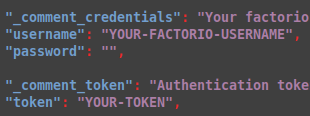

# Setting up Factorio Headless Server on Linux

This document provides a step-by-step guide to installing and configuring a Factorio headless server on Linux. Please note that this is not a tutorial for OS installation. Refer to the distribution's official documentation for assistance with that process.

### Choosing a Distribution
> [!NOTE]
> This section is only intended for new installation, you can skip it if you already posses a Unix machine running.


The choice of Linux distribution is a long-standing debate among users. If you're new to Linux, consider starting with **Linux Mint**, which is widely regarded as easy to use and suitable for beginners. Other popular distributions include Ubuntu and Ubuntu Server for advanced users.

| Distro | Download Link | Communities | Installation Guide |
| --- | --- | --- | --- |
| Linux Mint (recommended) | [Linux Mint](https://www.linuxmint.com/download.php) | Simple, intuitive interface | [Installation](https://linuxmint-installation-guide.readthedocs.io/en/latest/) |
| Ubuntu | [Ubuntu](https://ubuntu.com/download/desktop) | Similar to Linux Mint, but with additional features for advanced users | [Installation](https://ubuntu.com/tutorials/install-ubuntu-desktop#1-overview) |
| Ubuntu Server (Advanced) | [Ubuntu Server](https://ubuntu.com/download/server) | No graphical interface by default. Suitable for experienced users. | [Documentation](https://documentation.ubuntu.com/server/tutorial/) |

### Creating a Bootable USB

A bootable USB drive is required to install the OS on your machine. You may need to use a third-party tool to create one, such as [Etcher](https://etcher.balena.io/) or [Rufus](https://rufus.ie/).

* From Windows: Download and use Etcher or Rufus to create a bootable USB stick.
* From Linux: Most distributions provide an option to create a bootable USB drive when you right-click on the ISO file.

### Installing the OS

Please ensure that you have backed up all important files on your machine before proceeding.

With your bootable USB drive ready, follow these steps:

1. Boot from the USB drive and select your language and keyboard layout.
2. Follow the installation instructions provided by the distribution's installer.
> [!NOTE] 
> It is recommended not to enable disk encryption, as a password will be asked before the OS lauch on every reboot before and you will need to type it manually.

After installing the OS, update your system and restart your computer:

```bash
sudo apt update && sudo apt full-upgrade -y
```


# Headless Installation

Welcome back for those who did not need an OS. For the rest of this tutorial, I will assume you have:

- Physical or SSH access to the computer; if you need more information on how to set up SSH on your server, please refer to [setting up SSH on Ubuntu](https://itsfoss.com/set-up-ssh-ubuntu) and [SSH Keys](https://www.digitalocean.com/community/tutorials/how-to-set-up-ssh-keys-on-ubuntu-20-04).
- A working internet connection.
- Administrative access to the PC.

## Downloading the Files

First things first, we need to obtain the executable from the official Factorio website. You can download the latest version of the headless server from [https://www.factorio.com/download](https://www.factorio.com/download) and download the headless version. Alternatively, you can use a terminal command:

```bash
wget https://factorio.com/get-download/stable/headless/linux64 -O ~/factorio-headless.tar.xz
```

## Extracting the Files to /opt

We will place the game files in the `/opt` folder, which is reserved for all software and add-on packages not part of the default installation. Administrative rights are required.

In your terminal, you can type:

```bash
sudo tar -xf ~/factorio-headless.tar.xz -C /opt/
```

> [!WARNING]
> The extracted files are currently owned by the root user. Be cautious when running them as root, as this poses a security risk for now.

### Changing Ownership of the Files

To enhance the security of the setup, we will create a new user that will own the files and launch the server. If this user is compromised, the hacker's access to the PC will be limited.

In your terminal:

```bash
sudo adduser --disabled-login --no-create-home --gecos factorio factorio
```

Verify that the user has been created using:

```bash
getent passwd | grep factorio
```

The command should output a line similar to this:

```
factorio:x:1001:1001:factorio,,,:/usr/sbin/nologin
```

We've added a new user without setting a password (`--disabled-login`), without creating a home directory in `/home` (`--no-create-home`), and omitting the user's information (`--gecos`). This prevents the user from logging in, enhancing security.

Next, we'll change the ownership of the `/opt/factorio` folder and its contents to the new user:

```bash
sudo chown -R factorio:factorio /opt/factorio
```

You can add yourself to the `factorio` group for easier management of files. Alternatively, you can execute commands as `factorio` using:

```bash
sudo -u factorio COMMANDTOEXECUTE
```

Rebooting will ensure that any changes have taken effect.


Here is the rewritten version of the Markdown file with some improvements:

## Setting Up Your First Game
### About Space Age

> [!NOTE]
> If you don't own the Space Age DLC, **you must** delete the following folders to be able to join the server. Run the following command:

```bash
sudo rm -r /opt/factorio/data/elevated-rails/ /opt/factorio/data/quality/ /opt/factorio/data/space-age/
```

### The Config Files

Factorio uses multiple config files when invoked. The base installation comes with examples in `/factorio/data`. The most important one is probably `server-settings.json`, which you'll need to customize.

First, make a copy of the example file:
```bash
sudo -u factorio cp /factorio/data/server-settings.json /opt/factorio/data/my-server-settings.json
```
Then, edit the file to add your desired settings.

```bash
sudo -u factorio nano /opt/factorio/data/my-server-settings.json
```


While most of the command line parameters are straightforward and well-explained, there are a few that may require adjustments for optimal performance or security. These include:

* `game_password`: The password require to have access to the game
* `name`: The name of the game, as in the multiplayer creation screen.
* `description`: Description of the game.
* `tags`: Tags of the game useful for referencing.
* `autosave_interval`: The interval (in minutes) between autosaves. You can adjust this value to balance server performance and data recovery.
* `autosave_slots`: The number of autosave slots. Increasing this value allows for more rollbacks in case something goes wrong.
    + Recommendation: Use a high number (e.g., 30) to allow roll-back.
* `max_upload_slots`: Useful if you have a slow connection, to limit the amount of data uploaded at once.
* `visibility`: Sets the visibility of your server:
    + `true`: Publicly accessible via the game's multiplayer feature.
    + `lan`: Only accessible within a local area network (LAN).
    + `public requires valid factorio credentials`: Requiring players to log in with valid Factorio credentials before joining the game.


#### Credentials for Public Games

To create a public game, your Factorio account credentials must be added to the file. If you don't, you will only be able to play on local networks (LAN).

For security reasons, it's highly recommended to use a **token** instead of your password. Your token is displayed on your profile page and can be found by:

1. Logging in to your Factorio account at [https://factorio.com/profile](https://factorio.com/profile)
2. Locating your token details
3. Copying and pasting the token into the JSON file

In addition to your token, also add your **Factorio username**, which can be found on your profile page.



When adding the token, leave the password field blank.

### Command Line Parameters

The executable is located in `/opt/factorio/bin/x64/factorio`. Make sure it's executable:
```bash
sudo chmod u+x /opt/factorio/bin/x64/factorio
```
Start the server with the following command:
```bash
sudo -u factorio /opt/factorio/bin/x64/factorio --start-server
```
This will display all available parameters.

What you need to know is that you can create a map with the `--create` parameter, but it will probably be easier to create a map in your local computer and import it [see later](#get-a-save).

### Console Logs and Game Logs

There are two types of logs:

1. **Game logs**: These are logs about the current game, including game state changes, errors, network issues, and more. They're timestamped with a **game tick**.
2. **In-game console log**: This is the in-game chat log, which shows player joins, pings, and other events, timestamped with a **real-world timestamp**, making it easier to read.

To make the console logs available even if there's no screen (e.g., on a remote PC), you can redirect the console output to a file when starting the server:
```bash
--console-log /file/path/you/want
```
Put this into a file in `/opt/factorio/`.

### Whitelist, Banlist, and Adminlist


The 3 files are JSON files following the same structure:
```json
[
    "playername",
    "playername2",
    "playername3"
]
```

We can specify a whitelist file when starting the server, but not the other.
```bash
--use-server-whitelist --server-whitelist /opt/factorio/data/my-server-whitelist.json
```
If you don't use `--use-server-whitelist` the whitelist will not be memorized and the whitelist will be wipe at each reboot of the server.

If you don't specify a file with `--server-whitelist FILE`, a default file called `server-whitelist.json` will be created and used in `/opt/factorio`.

The adminlists and banlists, work the same way so you can create and populate them in advance.
Run the following command to create all the files:
```bash
sudo -u factorio touch /opt/factorio/server-banlist.json /opt/factorio/server-adminlist.json /opt/factorio/server-whitelist.json
```

> [!NOTE]
> You won't be able to promote yourself if you're not already an admin (in the admin file).


## Getting Started with Your Server
### Create a Saves Folder

First, create a saves folder where the game will store the saves if not already existing:
```bash
sudo -u factorio mkdir /opt/factorio/saves
```

### Choose or Create a Save File

You'll need to select either an existing save file or create one from scratch. You can:

* Use the command line to generate a new save file (see [Factorio documentation](https://wiki.factorio.com/Command_line_parameters) for more info).
* Import existing save file, either by copying it to the saves folder or using SSH to transfer it.

> [!NOTE]
> Save files are stored in different folders depending on your operating system. For more information, see [Factorio documentation](https://wiki.factorio.com/Application_directory).

To specify which save file to use when launching the server, you can use:

* `--start-server FILE` to load a specific save file.
* `--start-server-load-scenario MOD/NAME` to load a specific scenario from a mod. If no mod is specified, it will look for scenarios in the top-level directory.
* `--start-server-load-latest` to load the latest available save file in the saves folder, useful for automatic reboot.

### Mods

Mods are located in the `/opt/factorio/mods` folder. If you haven't run the executable yet, you may need to create it:
```bash
sudo -u factorio mkdir /opt/factorio/mods
```

You can now add your mods to the folder. You can download them from
the Factorio mods platforme (or other website), or as with the save file simply copy-paste the content from your own mods folder.

If the server crashes during initial setup, remove any mods and try restarting it.


### Running Your Server

Now that we have a save file, let's test our server:
```bash
sudo -u factorio/bin/x64/factorio --start-server-load-latest- --port 34197
```
The `--port` option specifies the UDP port to use for Factorio, default 34197. You may want to choose a specific port to avoid conflicts with your firewall.

Congratulations, you now have a running headless server! Quickly connect to your own server from your local computer.

But we're not done yet...

* **Firrewall**: We can activate the firewall on the PC to enhance its security, especially if you arre not behind a NAT.
* **Automated Launch**: To avoid having to type the command manually each time, we'll set up a service to launch automatically. This will make it easier to start your server without a simple click or command.
* **Remote Management**: If you haven't already set up SSH (Secure Shell) access, it will ease the management of the server remotely.

Here's the updated text:

# Security
## Firewall Configuration

If your server is exposed to the public internet, not behind an edge router or NAT, you'll want to configure the firewall to allow incoming connections on the default Factorio port (34197).

I use [Uncomplicated Firewall,](https://help.ubuntu.com/community/UFW), which is easy to set up and manage. To enable it:

```bash
sudo ufw enable
```

Next, allow incoming connections on Factorio's default port (or any other port you prefer):

```bash
sudo ufw allow 34197/udp
```

If you're using SSH for remote access, consider allowing it through the firewall as well:

```bash
sudo ufw allow ssh
```

If your server is internet-facing, consider implementing additional security measures to prevent brute-force login attempts. One option is to use [Fail2ban](https://en.wikipedia.org/wiki/Fail2ban), that helps detect and block repeated unauthorized login attempts.


# Service and Other
## Automatic Service with Systemd

To ensure that your Factorio server runs automatically on boot and restarts if it crashes, you'll need to create a systemd service file. This will enable your server to start as soon as your system boots up.

**Create the `factorio.service` file**

```bash
sudo nano /etc/systemd/system/factorio.service
```

Add the following content to the file:
```bash
[Unit]
Description=Factorio Headless Server
Wants=network-online.target
After=network.target network-online.target multi-user.target
StartLimitIntervalSec=600

[Service]
Type=simple
User=factorio
Group=factorio
Restart=on-failure
RestartSec=20
StartLimitBurst=5
KillSignal=SIGINT
TimeoutStopSec=10
ExecStart=/opt/factorio/bin/x64/factorio --start-server-load-lastest --server-settings /opt/factorio/data/server-settings.json --port 34197

[Install]
WantedBy=multi-user.target
```

**Note:** Make sure to replace the `ExecStart` parameter with your server parameters [Whitelist, Banlist and Adminlist](#whitelist-banlist-and-adminlist). You can also modify the `--port` parameter as needed.

**Enable the service**

```bash
sudo systemctl daemon-reload
sudo systemctl enable factorio.service
```

This reload the systemd daemon and will enable the service.

**Verify the service status**

To check the status of your service, run:
```bash
systemctl status factorio.service
```
**Manage the service**

You can manage your service using the following commands:

* `sudo systemctl start factorio.service` : Start the service
* `sudo systemctl restart factorio.service` : Restart the service
* `sudo systemctl stop factorio.service` : Stop the service
* `sudo systemctl disable factorio.service` : Disable the service

If you want to remove the service completely, run:
```bash
sudo systemctl stop factorio.service
sudo systemctl disable factorio.service
sudo rm /etc/systemd/system/factorio.service
sudo systemctl daemon-reload
```
This will delete the service file and reload the systemd daemon.


Here's the updated text:

## Update
### Updating Mods

Before updating mods on your server, make sure to test them locally on your PC using a save from the server. This will ensure that everything works as expected.

To update mods on your server:

1. Stop the Factorio instance:
```bash
sudo systemctl stop factorio.service
```
2. Copy your new mods to the folder, make sure they are owned by the `factorio` user:
```bash
sudo -u factorio cp -r /path/to/new/mods /opt/factorio/mods/
```
3. Restart the server:
```bash
sudo systemctl restart factorio.service
```

### Updating the Game

If you want to update the game itself, be aware that this may cause compatibility issues, make sure to test any updates locally on your PC before updating.

To update the game:

1. Stop the Factorio instance:
```bash
sudo systemctl stop factorio.service
```
2. Download the latest version of Factorio Headless from their website:
```bash
sudo -u factorio wget 'https://factorio.com/get-download/stable/headless/linux64' -O /tmp/factorio-headless.tar.xz
```
3. Back up your existing game folder:
```bash
sudo mkdir /opt/BackupFactorioUpdate
sudo cp -r /opt/factorio/ /opt/BackupFactorio/
```
4. Replace the old version of Factorio Headless with the new one:
```bash
sudo -u factorio tar -xf /tmp/factorio-headless.tar.xz -C /opt/
```
5. Reload the systemd daemon and restart the service:
```bash
sudo systemctl daemon-reload
sudo systemctl restart factorio.service
```
